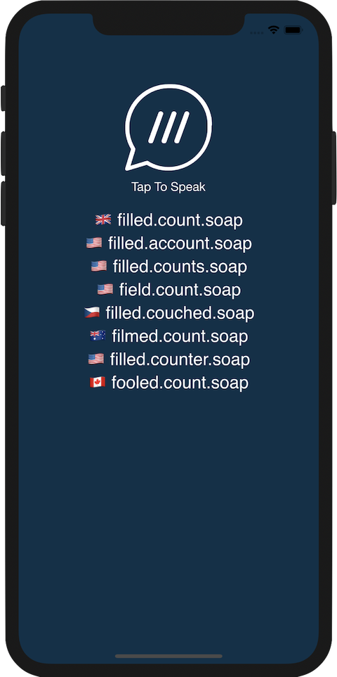
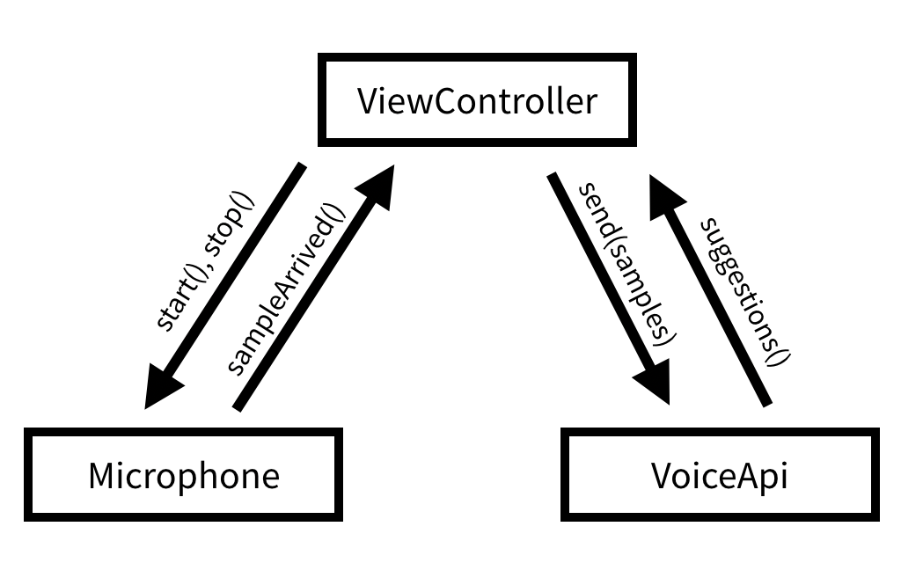

# Voice API Example



### Getting Started

The first steps to getting started are:

1. [Select our free plan](https://accounts.what3words.com/create-api-key?referrer=/voice-api) and create an API key.
2. Add a Voice API plan in [your account](https://accounts.what3words.com/billing).
3. Take a look at the [online documentation](https://developer.what3words.com/voice-api).

### Requirements

iOS 9.0 and up,
Xcode 11.0 and up

### Overview

This is a quick example using what3words' VoiceAPI.  It is a very minimal implementation to show how the basics work.  It is designed to provide illumnation on the API in advance of a full Swift API wrapper being formally published.


##### class ViewController



This heart of this very basic app is in ViewController which contains a `VoiceApi` object and a `Microphone` object.  It basically turns on the microphone and streams audio data to the voice obeject when a button is tapped.

The VoiceApi and Microphone objects take closures for event callbacks such as when new data have arrived from the microphone, or some three word address suggestions have returned from the server.  These closures are assigned set in `viewDidAppear()`

When `VoiceSuggestions` come back from `VoiceApi`, we simply throw some UILabels up on the screen.

##### class Microphone

The `Mircophone` class has a `start()`, and `stop()` to start and end recording, and a callback closure variable called `sampleArrived` which is invoked when new audio data is available.

##### class VoiceApi

The `VoiceApi` class handles the what3words Voice API.  It uses a slight variation of Josh Baker's Swift WebSocket class (see next section) to handle all the nuts and bolts of communication.

First you call `open(...)` with the audio parameters, and what3words options, then `send(samples: Data)` is to be called with the audio data as it is available.

Finally, when three word addresses are recognized, it calls the `suggestions` which is a callback of the form `([VoiceSuggestion]) -> ()` with an array of `VoiceSuggestion`.  

Details:

###### open()
```
open(sampleRate:Int, encoding:String = "pcm_f32le", language:String = "en", resultCount:Int? = nil, focus:CLLocationCoordinate2D? = nil, focusCount:Int? = nil, country:String? = nil, circleCenter:CLLocationCoordinate2D? = nil, cicleRadius:Double? = nil)
```

This opens the socket to the server using a URL with a querystring containing all the desired `autosuggest()` parameters, and then it sends a handshake in the form of a JSON message containing paramters for the audio to come.

###### send()

```
send(samples: Data)
```
This will send the audio data to the server.  This is called everytime new audio data is recieved from the microphone

##### Suggestion callback

```
VoiceApi.suggestions: ([VoiceSuggestion]) -> ()
```
This callback is called when new `VoiceSuggestion` are recignized from the audio data.

### WebSockets

This example uses Josh Baker's Swift WebSocket class.  iOS has URLSessionWebSocketTask but it's only available in iOS 13 or later.  It was thought an example that also worked on previous OSes would be more useful.  

This WebSocket class has been modified to compile with Swift 5, and allow the setting of a larger buffer. The `send()` has been made tolerant of `Data` larger than the buffer size by modifing the code to break up data and send in smaller packages.


### Example suggestions JSON

```
{
   "message":"Suggestions",
   "suggestions":[
      {
         "country":"GB",
         "nearestPlace":"Bayswater, London",
         "words":"filled.count.soap",
         "distanceToFocusKm":0,
         "rank":1,
         "language":"en"
      },
      {
         "country":"GR",
         "nearestPlace":"Týrnavos, Thessaly",
         "words":"filled.count.soaped",
         "distanceToFocusKm":0,
         "rank":2,
         "language":"en"
      },
      {
         "country":"US",
         "nearestPlace":"Fisher, Illinois",
         "words":"filled.count.snow",
         "distanceToFocusKm":0,
         "rank":3,
         "language":"en"
      },
      {
         "country":"US",
         "nearestPlace":"Lake Geneva, Wisconsin",
         "words":"filled.count.solo",
         "distanceToFocusKm":0,
         "rank":4,
         "language":"en"
      },
      {
         "country":"US",
         "nearestPlace":"Lents, Oregon",
         "words":"filled.counts.soap",
         "distanceToFocusKm":0,
         "rank":5,
         "language":"en"
      },
      {
         "country":"US",
         "nearestPlace":"Alturas, California",
         "words":"filled.count.soaked",
         "distanceToFocusKm":0,
         "rank":6,
         "language":"en"
      },
      {
         "country":"GB",
         "nearestPlace":"Whitefield, Bury",
         "words":"filled.count.soak",
         "distanceToFocusKm":0,
         "rank":7,
         "language":"en"
      },
      {
         "country":"US",
         "nearestPlace":"Upper Nyack, New York",
         "words":"filled.counts.hope",
         "distanceToFocusKm":0,
         "rank":8,
         "language":"en"
      }
   ]
}
```
